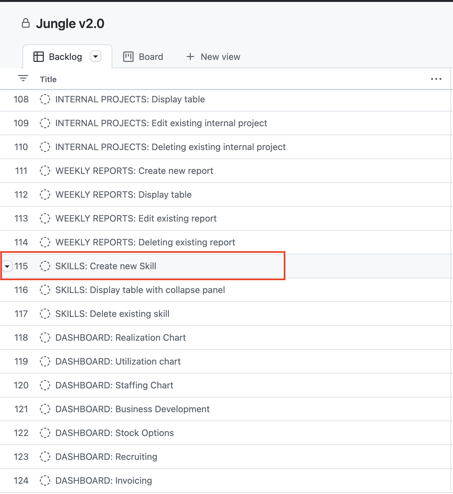
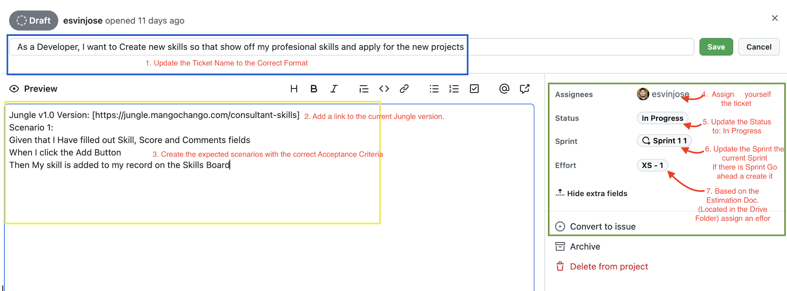

# Writing a user Story

## What is a User Story

User stories is a small piece of work that represents some value to an end user and can be delivered during a sprint. User stories are one of the core elements of the Agile methodology.

User Stories always fit **INVEST** criteria:
- **Independent**: They can be developed in any sequence and changes to one User story don't affect the others.
- **Negotiable**: It's up for the team to decide how to implement them: there is no rigidly fixed workflow.
- **Valuable**: Each User story delivers a detached unit of value to end users.
- **Estimable**: Each User story should be easy to guess how much time the development will take.
- **Small**: It should go through the whole cycle (Designing, Coding, Testing) during one sprint.
- **Testable**: There should be clear acceptance criteria to check whether a User Story is implemented appropriately.

### What is the correct User Story name format

The format should be plain and short:

As a [type of user], I want [an action] so that [a benefit/value]

For Example:

- As a driver, I want to add photos of my car in my profile so that I can attract more users

### How to Write User Stories

User stories seem to be short and easy to write, but most of the time they require a specific workflow that help us deliver the best Stories:

1. Think of the "**Who**"

  Make up the list of your end users. Each story should be valuable to some group of end users. Don't think of users only as external customers, make sure to take into account internal users such as admins, editors, etc.

2. Think of the "**What**"

  Define what functionality each user expects, how they are going to interact with the app. Remember to describe an intention, not a feature. Keep it short. 

3. Think of the "**Why**"

  Define the value that users get after performing an action. The ***why*** will answer how it it affects metrics and KIP's like: Improve UX, increase retention rates. Remember each story should contribute to something to the general goal of the product.

4. Discuss the story with the Team

  After creating the user story always create a discussion with the whole Team working on the project. It will help to understand how it should work and agree on acceptance criteria. Also, will allow to find out the best way to implement User Stories from the tech perspective. 

## What is a User Story Acceptance Criteria

The acceptance criteria are a set of conditions that are used to confirm when a Story is completed. A user Story can contain one or several Acceptance Criteria depending of number of scenarios that exist for a specific task. 

The ACs are sometimes called **definition of done** because they define the scope and requirements of user stories. 

### The Given/When/Then Acceptance Criteria

The format follows the template:

* Scenario: (explain scenario). 
  * Given (how things begin)
  * when (Action taken) 
  * then (outcome of taking action)

For Example:

* User story:

  As product manager, I want to score potential ideas,
  So that I Can decide what include on my product roadmap.

* Acceptance Criteria:

  **Scenario**: The product manager adds potential ideas and ranks the best ideas based on benefit versus cost.

  - Given that I have added two or more ideas and scored them
  - When I click the Rank button
  - Then ideas are sorted with the top-scoring ideas at the top.

### Why do we need Acceptance Criteria

- Managing expectations
- Defining scope and reducing ambiguity
- Establish testing criteria for QA
- Defending against scope creep mid sprint

## What about EPICS

An Epic is a high level body of work that bands together a group of related Stories.

For Example:

* An Epic: Managing Profiles
  * A Story: As an app user, I want to add profile photos so I get recognized by my followers
  * A Story: As an admin, I want to block photos from users, so that they don't violate community rules.

## How to work on Jungle v2.0 User's stories

1. Navigate to the [Board](https://github.com/orgs/Mango-chango/projects/3)
2. From the Board pick a ticket

3. Open the ticket and perform the following updates:

4. Go ahead Read the Contribution Guide and start hacking.
